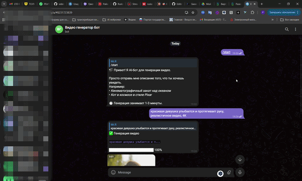

# 🎬 AI Video Generator

AI-приложение для генерации видеороликов через Proxy API.

## 📱 Особенности
- **Веб-интерфейс**: Современный сайт с отслеживанием прогресса генерации.
- **Telegram-бот**: Генерация видео прямо в чате.
- **Умная архитектура**: Единое ядро (`video_service`) для сайта и бота.
- **Безопасность**: Ключи API хранятся локально (`.env`).

## 🛠 Технологии
- Python 3.10+
- Flask (Web Framework)
- pyTelegramBotAPI (Telegram Bot)
- Proxy API (Sora-2 model)

##  Установка

1. Клонируйте репозиторий:
   ```bash
   git clone https://github.com/Ruslan-promt-engineer/ai-video-generator.git
   cd video-gen

### 🎬 Демонстрация работы



*На скринкасте: отправка промпта в бота → отслеживание прогресса → получение готового MP4 файла*